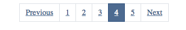
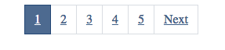

# VUE Pagination

This Package provide pagination system for your VUE app, it can work with any backend envoriment.
 
## Installation

**using NPM:**

`npm install --save vue-paginator-ak`

```html
<template>
	<paginator
			v-bind:data-length="datalength"
			v-bind:data-limit="limit"
			alignment="center"
			v-bind:preserve-url="false"
			@changed="fetch"
			>
		</paginator>
</template>
```

```javascript
<script>
import Paginator from "vue-paginator-ak";
export default {
  components: { Paginator },
	...rest of your component
  }
  </script>
```

**using script link:**

```html
<script src="https://unpkg.com/vue-paginator-ak"></script>
```

## Usage

This components accept five props:

1. dataLength ***Required***
2. dataLimit ***Required***
3. totalLinks ***Optional*** 
4. alignment ***Optional*** 
5. preserveUrl ***Optional***

This Props  allow you to pass the necceassery data in order this components to operate and give you the ability to custimze total links which will be displaied and pagination navigation alignment. 

---
### Props Details 

- **dataLength**: 
  - **type**: `Stirng or Number`
  - **required**: `true`
  - **description**: You need to pass the total pages or results so the pagination calculation can take place. 
---
- **dataLimit**: 
  - **type**: `String or  Number`
  - **required**: `true`
  - **description**: Limit of pages to be rendered. 
---
- **totalLinks**
  - **type**: `String or Number`
  - **required**: `false`
  - **default**: `5`
  - **description**: you can specificy how many link to be rendered in the pagination bar.
---
- **alignment**
  - **type**: `String`
  - **required**: `false`
  - **default**: `flex-end`
  - **options**: `flex-start , center , flex-end`
  - **description**: you can custimze the pagination alignment to be displaid either in the left , center or right of the page. 
 ---
- **preserveUrl**
  - **type**: `Boolean`
  - **required**: `false`
  - **default**: `false`
  - **description**:

---

### Events:

When the page link is clicked or changed this components will trigger ``changed`` events and provide the chosen page number to other components to act accordingly if necessary


### Examples:


```html
<paginator data-length="25" data-limit="5" alignment="center" :preserve-url="true"></paginator>
```


**Laravel paginator**

We will assume in the following two examples that you have assign the http to variable called response and use data provided as our source


 ```javascript
<paginator
 v-bind:data-length="response.data.total" 
 v-bind:data-limit="response.data.per_page" 
 alignment="center" 
 v-bind:preserve-url="true">
 </paginator>
```
 
 **Laravel API Resource**

 ```javascript
<paginator
 v-bind:data-length="response.data.meta.total" 
 v-bind:data-limit="response.data.meta.per_page" 
 alignment="center" 
 v-bind:preserve-url="true">
 </paginator>
```
 

 **Screen Shot**





